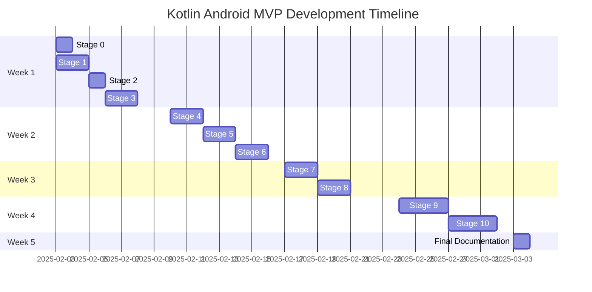
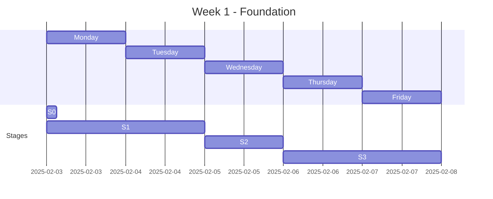
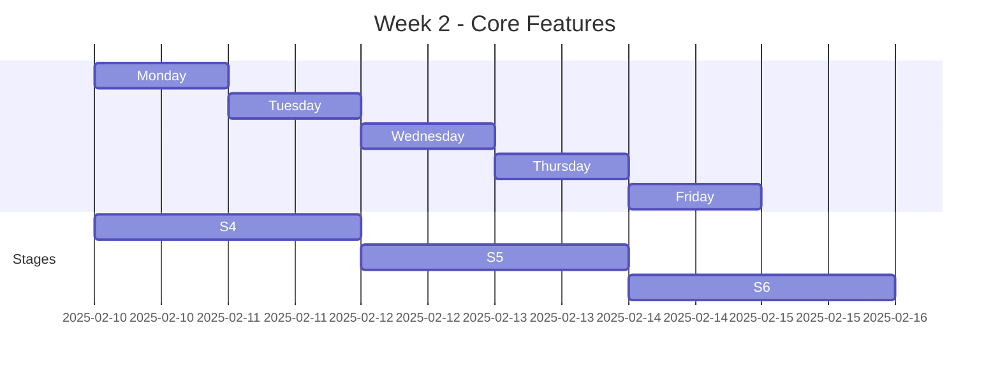
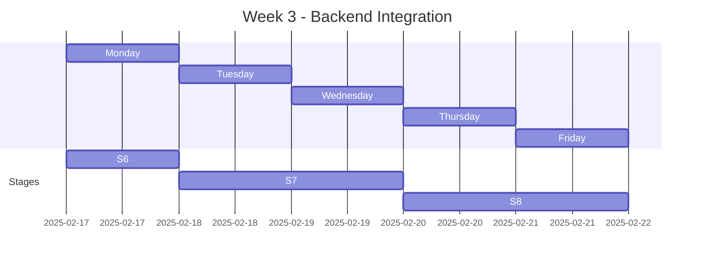
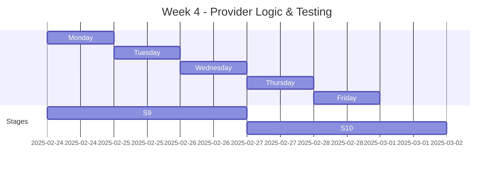
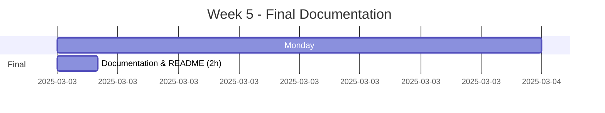
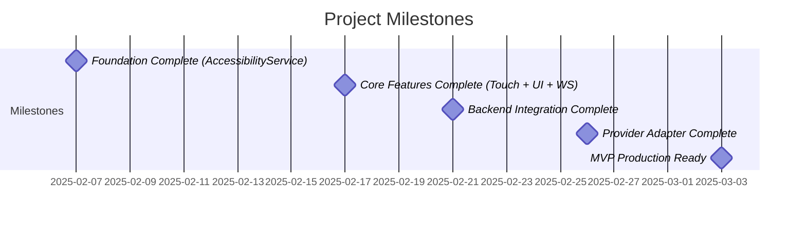

## 3 Hours/Day, Weekdays Only (Mon-Fri)

**Total Duration:** 5 weeks (21 working days)  
**Total Hours:** 55 hours  
**Daily Commitment:** 3 hours per day

---

## 📊 Gantt Chart (Mermaid)



---

## 📅 Weekly Schedule

### Week 1: Foundation (Feb 3-7)



**Daily Plan:**

- **Monday**: Setup (2h) + Project Setup start (1h) = 3h
- **Tuesday**: Complete Project Setup (3h) = 3h
- **Wednesday**: Basic UI & Service Status (3h) = 3h
- **Thursday**: AccessibilityService Part 1 (3h) = 3h
- **Friday**: AccessibilityService Part 2 (2h) = 2h

**Deliverable:** Working app with AccessibilityService enabled

---

### Week 2: Core Features (Feb 10-14)



**Daily Plan:**

- **Monday**: Random Touch Part 1 (3h) = 3h
- **Tuesday**: Random Touch Part 2 (1h) + UI Detection start (2h) = 3h
- **Wednesday**: UI Detection complete (3h) = 3h
- **Thursday**: UI Detection finish (0h) + WebSocket start (3h) = 3h
- **Friday**: WebSocket Part 1 (3h) = 3h

**Deliverable:** App can find and tap UI elements, WebSocket connection ready

---

### Week 3: Backend Integration (Feb 17-21)



**Daily Plan:**

- **Monday**: WebSocket complete (3h) = 3h
- **Tuesday**: Time Sync Part 1 (3h) = 3h
- **Wednesday**: Time Sync Part 2 (1h) + Round Scheduler start (2h) = 3h
- **Thursday**: Round Scheduler (3h) = 3h
- **Friday**: Round Scheduler complete (1h) + buffer (2h) = 3h

**Deliverable:** Full backend integration, round execution working

---

### Week 4: Provider Logic & Testing (Feb 24-28)



**Daily Plan:**

- **Monday**: Provider Adapter (3h) = 3h
- **Tuesday**: Provider Adapter (3h) = 3h
- **Wednesday**: Provider Adapter complete (2h) + Testing start (1h) = 3h
- **Thursday**: Testing (3h) = 3h
- **Friday**: Testing & Polish (3h) = 3h

**Deliverable:** Production-ready MVP with Evolution Gaming adapter

---

### Week 5: Documentation & Launch (Mar 3)



**Daily Plan:**

- **Monday**: Final documentation, README, deployment guide (2h) = 2h

**Deliverable:** Complete MVP with full documentation 🎉

---

## 📋 Stage Breakdown (Table View)

|Stage|Name|Duration|Week|Days|Hours|
|---|---|---|---|---|---|
|0|Prerequisites & Setup|2h|1|Mon|2|
|1|Project Setup & Architecture|4h|1|Mon-Tue|4|
|2|Basic UI & Service Status|3h|1|Wed|3|
|3|AccessibilityService|5h|1|Thu-Fri|5|
|4|Random Touch Implementation|4h|2|Mon-Tue|4|
|5|UI Node Detection|5h|2|Wed-Thu|5|
|6|WebSocket Client|6h|2-3|Fri-Mon|6|
|7|Time Synchronization|4h|3|Tue-Wed|4|
|8|Round Scheduler & Execution|6h|3|Wed-Fri|6|
|9|Provider Adapter Pattern|8h|4|Mon-Wed|8|
|10|Testing & Polish|8h|4|Wed-Fri|8|
|11|Final Documentation|2h|5|Mon|2|

**Total: 57 hours across 21 working days**

---

## ✅ Progress Tracker

Copy this to your daily notes:

```markdown
## Week 1 Progress
- [ ] Mon: Stage 0 (2h) + Stage 1 start (1h) ⏱️ 3h
- [ ] Tue: Stage 1 complete (3h) ⏱️ 3h
- [ ] Wed: Stage 2 (3h) ⏱️ 3h
- [ ] Thu: Stage 3 part 1 (3h) ⏱️ 3h
- [ ] Fri: Stage 3 part 2 (2h) ⏱️ 2h

## Week 2 Progress
- [ ] Mon: Stage 4 part 1 (3h) ⏱️ 3h
- [ ] Tue: Stage 4 done + Stage 5 start (3h) ⏱️ 3h
- [ ] Wed: Stage 5 complete (3h) ⏱️ 3h
- [ ] Thu: Stage 6 start (3h) ⏱️ 3h
- [ ] Fri: Stage 6 continue (3h) ⏱️ 3h

## Week 3 Progress
- [ ] Mon: Stage 6 done + Stage 7 start (3h) ⏱️ 3h
- [ ] Tue: Stage 7 complete (3h) ⏱️ 3h
- [ ] Wed: Stage 8 start (3h) ⏱️ 3h
- [ ] Thu: Stage 8 continue (3h) ⏱️ 3h
- [ ] Fri: Stage 8 done (3h) ⏱️ 3h

## Week 4 Progress
- [ ] Mon: Stage 9 start (3h) ⏱️ 3h
- [ ] Tue: Stage 9 continue (3h) ⏱️ 3h
- [ ] Wed: Stage 9 done + Stage 10 start (3h) ⏱️ 3h
- [ ] Thu: Stage 10 testing (3h) ⏱️ 3h
- [ ] Fri: Stage 10 polish (3h) ⏱️ 3h

## Week 5 Progress
- [ ] Mon: Documentation (2h) ⏱️ 2h ✨ MVP COMPLETE!
```

---

## 🎯 Key Milestones



---

## 📊 Time Distribution Chart

```markdown
### Hours by Category
- Setup & Foundation: 14h (25%)
- Core Features: 15h (27%)
- Backend Integration: 13h (23%)
- Provider & Testing: 16h (28%)

### Hours by Week
- Week 1: 14h (Foundation)
- Week 2: 15h (Core Features)
- Week 3: 13h (Backend)
- Week 4: 15h (Provider + Testing)
- Week 5: 2h (Documentation)
```

---

## 💡 Tips for Success

### Daily Routine

```markdown
**Before Starting (5 min):**
- [ ] Open this Gantt chart
- [ ] Check today's tasks
- [ ] Review previous day's work

**During Session (3h):**
- [ ] Work on current stage tasks
- [ ] Test as you go
- [ ] Commit frequently
- [ ] Log progress in notes

**After Session (5 min):**
- [ ] Mark tasks complete
- [ ] Commit final changes
- [ ] Note any blockers
- [ ] Plan tomorrow's focus
```

### Weekend Strategy

- Use Saturdays for overflow if needed
- Sundays for review and planning
- Don't work if ahead of schedule

### Tracking in Obsidian

Create a note: `Kotlin MVP Progress.md`

```markdown
# Kotlin MVP Progress

## Current Status
- **Stage:** 3
- **Week:** 1
- **Hours Completed:** 9/57
- **On Track:** ✅ Yes

## This Week's Goals
- [ ] Complete Stage 3
- [ ] Foundation milestone reached

## Blockers
- None

## Notes
- Stage 2 went faster than expected (2.5h instead of 3h)
- Saved 30min for buffer
```

---

## 🔗 Quick Links

- [[Kotlin MVP Development - Stage Guide]]
- [[Daily Progress Log]]
- [[Technical Documentation]]
- [[Testing Checklist]]

---

_Last Updated: 2025-01-26_  
_Timeline adjusted for 3h/day, weekdays only_