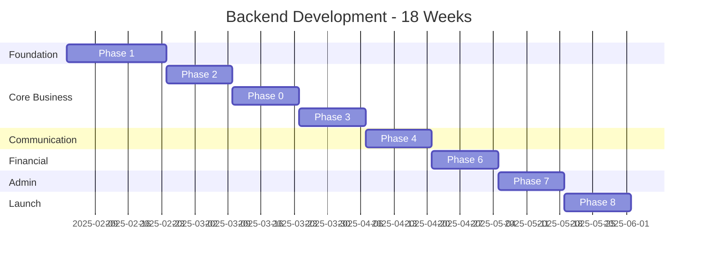

# Laravel Backend Development Roadmap

**Project:** Betting Coordination Backend API  
**Duration:** 18 weeks (23 weeks including mobile)  
**Team:** 2 Backend Engineers  
**Tech Stack:** Laravel 11, PostgreSQL 16, Redis 7, Reverb

---

## 📋 Complete Phase Overview

This roadmap provides a high-level view of all backend development phases, organized by implementation priority and dependencies.

---

## Phase Structure

### Phase 0: IP Management System ⭐ NEW - HIGH PRIORITY
**Duration:** 2 weeks (Weeks 5-6)  
**Purpose:** Critical operational requirement from client

**What Gets Built:**
- Device IP tracking with history
- IP conflict detection engine
- Proxy pool with health monitoring
- Automatic IP rotation
- Provider-specific IP rules
- Admin dashboard integration

**Why First:**
- Critical for preventing provider detection
- Required before any betting operations
- Complex domain logic needs early validation
- Affects both backend and mobile architecture

**Key Deliverables:**
- ✅ `device_ips` table with active/inactive tracking
- ✅ `proxy_pool` table with health scoring
- ✅ `ip_conflict_rules` per provider
- ✅ `IpConflictDetector` service
- ✅ `ProxyPoolManager` service
- ✅ Conflict detection API endpoints
- ✅ Proxy rotation API

**Reference:** [[../Design Document/8. Business Rules & Algorithms#IP Conflict Detection]]

---

### Phase 1: Foundation & Infrastructure
**Duration:** 3 weeks (Weeks 1-3)  
**Purpose:** Solid technical foundation for all features

**What Gets Built:**
- Laravel 11 project with PostgreSQL 16
- Redis 7 (cache, sessions, queues)
- Reverb WebSocket server
- Horizon queue monitoring
- Complete database schema (12+ tables)
- Eloquent models with relationships

**Why It Matters:**
- Everything depends on this foundation
- Database schema changes are expensive later
- Queue infrastructure needed for async tasks
- WebSocket setup is complex

**Key Deliverables:**
- ✅ Laravel app running with proper configuration
- ✅ PostgreSQL database with all tables
- ✅ Redis operational (3 separate DBs: cache, queue, session)
- ✅ Horizon dashboard monitoring queues
- ✅ All Eloquent models with relationships
- ✅ `backend/` directory in monorepo with CI/CD pipeline

**Reference:** [[../Design Document/3. Database Schema]]

---

### Phase 2: Team & Matchup Management
**Duration:** 2 weeks (Weeks 4-5)  
**Purpose:** Core business entities for organizing accounts

**What Gets Built:**
- `TeamService` - CRUD for teams
- `MatchmakingService` - Team pairing logic
- `AccountService` - Account management
- REST API endpoints for teams/matchups/accounts
- Admin panel (Filament) basics

**Why It Matters:**
- Teams are the organizational unit
- Matchups determine betting topology (1v1, 1v2)
- Accounts need commission tracking
- Foundation for allocation engine

**Key Deliverables:**
- ✅ Create/Read/Update/Delete teams
- ✅ Assign accounts to teams
- ✅ Create matchups (manual + auto-balanced)
- ✅ View team statistics
- ✅ Filament admin UI for management

**User Stories:**
- "As admin, I can create Team Alpha with 5 accounts"
- "As admin, I can match Team A vs Team B for baccarat"
- "As admin, I can see total commission per team"

**Reference:** [[../Design Document/2. Architecture#Team Management Module]]

---

### Phase 3: Allocation Engine ⭐ CORE ALGORITHM
**Duration:** 2 weeks (Weeks 6-7)  
**Purpose:** Calculate fair bet distribution

**What Gets Built:**
- `AllocationEngine` with commission-weighted algorithm
- `SeededRandom` for reproducible randomness
- Monotonic constraint enforcement
- Capital validation before locking
- Queue job for async allocation

**Algorithm Features:**
- ✅ Commission-weighted (higher commission = higher bet)
- ✅ Monotonic (ordering preserved: 5% > 3% > 1%)
- ✅ Randomized (±15% variance to avoid patterns)
- ✅ Capital-respecting (never exceeds budget)
- ✅ Reproducible (same seed = same result)

**Example:**
```
Input:
  Accounts: A(1%), B(3%), C(5%)
  Capital: $900
  Seed: "round_123"

Output:
  A: $93.88  (lowest commission)
  B: $318.37 (medium commission)
  C: $487.75 (highest commission)
  Total: $900.00 ✓
```

**Key Deliverables:**
- ✅ Working allocation algorithm
- ✅ Unit tests (95%+ coverage)
- ✅ Performance benchmark (<500ms for 100 accounts)
- ✅ Integration with capital locking

**Reference:** [[../Design Document/8. Business Rules & Algorithms#Allocation Engine]]

---

### Phase 4: Round Lifecycle & WebSocket
**Duration:** 2 weeks (Weeks 8-9)  
**Purpose:** Real-time device communication

**What Gets Built:**
- Round state machine (5 states)
- WebSocket broadcasting via Reverb
- Device acknowledgment protocol
- HMAC signature verification
- Round preparation → distribution → execution flow

**State Machine:**
```
PREPARING → PREPARED → EXECUTING → COMPLETED
     ↓           ↓          ↓
   ABORTED    ABORTED    ABORTED
```

**WebSocket Flow:**
1. Backend prepares round (runs allocation)
2. Backend broadcasts via WebSocket
3. Devices acknowledge receipt
4. Devices execute at timestamp
5. Devices report results
6. Backend settles and updates balances

**Key Deliverables:**
- ✅ Round state transitions working
- ✅ Reverb WebSocket operational
- ✅ Acknowledgment tracking
- ✅ Signature verification
- ✅ Event broadcasting to devices

**Reference:** [[../Design Document/4. API Specification#WebSocket Events]]

---

### Phase 5: Mobile Execution Engine (MOBILE TEAM)
**Duration:** 3 weeks (Weeks 10-12) - Parallel with Backend Phase 6-7  
**Note:** This is handled by mobile team

**Backend Support Needed:**
- WebSocket events (already in Phase 4)
- Time sync endpoint
- Result reporting endpoint
- Device registration API

---

### Phase 6: Capital Management & Settlement
**Duration:** 2 weeks (Weeks 13-14)  
**Purpose:** Track funds and settle bets

**What Gets Built:**
- `CapitalService` - Balance operations
- Lock/unlock capital for rounds
- Settlement engine (win/loss/tie)
- Auto-pause on low balance
- Transaction history
- Balance snapshots

**Capital Flow:**
```
1. Lock capital when round prepared
2. Execute bets (mobile)
3. Collect results
4. Update balances based on outcome
5. Unlock remaining capital
6. Check auto-pause threshold
```

**Auto-Pause Logic:**
```php
if (available_balance < min_threshold) {
    account.status = 'paused'
    notify_admin()
}
```

**Key Deliverables:**
- ✅ Capital locking mechanism
- ✅ Settlement with outcome verification
- ✅ Auto-pause when low balance
- ✅ Transaction audit trail
- ✅ Balance reconciliation reports

**Reference:** [[../Design Document/8. Business Rules & Algorithms#Capital Management Rules]]

---

### Phase 7: Admin Panel & Monitoring
**Duration:** 2 weeks (Weeks 15-16)  
**Purpose:** Complete Filament admin interface

**What Gets Built:**
- Filament 3 resources for all entities
- Real-time monitoring dashboard
- Round execution viewer
- Device status panel
- Telemetry collection
- Audit log viewer with search
- Performance analytics

**Admin Features:**
- ✅ Team/Account/Matchup management UI
- ✅ Create rounds manually
- ✅ Monitor active rounds
- ✅ View device health
- ✅ Search audit logs
- ✅ View capital statistics
- ✅ IP conflict dashboard
- ✅ Proxy health monitoring

**Dashboard Widgets:**
- Active devices count
- Rounds executed today
- Success rate percentage
- Total capital locked
- Low balance alerts
- IP conflicts detected

**Reference:** [[../Design Document/2. Architecture#Admin Interface]]

---

### Phase 8: Testing, Security & Deployment
**Duration:** 2 weeks (Weeks 17-18)  
**Purpose:** Production readiness

**Testing:**
- ✅ Unit tests (80%+ coverage)
- ✅ Integration tests (API endpoints)
- ✅ Load testing (2000+ devices)
- ✅ WebSocket stress test
- ✅ Allocation engine accuracy tests

**Security:**
- ✅ Penetration testing
- ✅ SQL injection prevention
- ✅ XSS/CSRF protection
- ✅ API rate limiting
- ✅ WebSocket authentication
- ✅ Encrypted sensitive data

**Deployment:**
- ✅ Docker containerization
- ✅ Production environment setup
- ✅ Database backup procedures
- ✅ Monitoring (Prometheus + Grafana)
- ✅ Logging (ELK stack)
- ✅ Rollback procedures
- ✅ Incident response playbook

**Performance Targets:**
- ✅ 1000+ concurrent WebSocket connections
- ✅ <500ms allocation engine response
- ✅ <100ms API response time (95th percentile)
- ✅ 99.9% uptime
- ✅ Zero capital calculation errors

---

## 📊 Visual Timeline



---

## 🎯 Phase Dependencies

```
Phase 1 (Foundation)
    ↓
Phase 2 (Teams & Matchups)
    ↓
Phase 0 (IP Management) ← Must come before allocation
    ↓
Phase 3 (Allocation Engine)
    ↓
Phase 4 (WebSocket & Rounds)
    ↓
Phase 6 (Capital Management)
    ↓
Phase 7 (Admin Panel)
    ↓
Phase 8 (Testing & Deployment)
```

**Critical Path:**
Foundation → Teams → IP Management → Allocation → WebSocket → Capital → Admin → Deploy

**Parallel Work Opportunities:**
- Phase 7 (Admin Panel) can start alongside Phase 6 (Capital)
- Mobile development (Phase 5) runs parallel with Backend Phases 6-7

---

## 📝 Stage-by-Stage Breakdown

Each phase is broken into discrete stages (see [[Laravel Backend - Development Stages Guide]] for complete details):

### Example: Phase 3 Breakdown
```
Week 6:
  Stage 3.1: Allocation Engine Core (3 days)
  Stage 3.2: Monotonic Constraints (2 days)

Week 7:
  Stage 3.3: Capital Validation (2 days)
  Stage 3.4: Queue Job Implementation (2 days)
  Stage 3.5: Testing & Optimization (1 day)
```

---

## ✅ Definition of "Done" per Phase

### Phase 0 (IP Management)
- [ ] All IP conflict rules implemented
- [ ] Proxy pool with health scoring
- [ ] Rotation algorithm working
- [ ] API endpoints functional
- [ ] Admin dashboard shows IP status
- [ ] Tests passing (80%+ coverage)

### Phase 1 (Foundation)
- [ ] Laravel app builds and runs
- [ ] All database tables created
- [ ] Redis operational
- [ ] Horizon monitoring queues
- [ ] All models have relationships
- [ ] Tests passing

### Phase 2 (Teams & Matchups)
- [ ] CRUD operations for teams/accounts
- [ ] Matchup creation (manual + auto)
- [ ] API endpoints documented
- [ ] Filament admin pages working
- [ ] Tests passing

### Phase 3 (Allocation)
- [ ] Algorithm produces correct results
- [ ] All 5 properties verified (commission-weighted, monotonic, randomized, capital-respecting, reproducible)
- [ ] Performance meets targets (<500ms)
- [ ] Tests cover edge cases
- [ ] Queue job processes allocations

### Phase 4 (WebSocket)
- [ ] Reverb server operational
- [ ] Devices can connect
- [ ] Events broadcast correctly
- [ ] Acknowledgments tracked
- [ ] Signatures verified
- [ ] Stress test passed (1000+ connections)

### Phase 6 (Capital)
- [ ] Lock/unlock working
- [ ] Settlement handles all outcomes
- [ ] Auto-pause triggers correctly
- [ ] Audit logs complete
- [ ] Reconciliation reports accurate

### Phase 7 (Admin)
- [ ] All resources accessible
- [ ] Dashboard shows real-time data
- [ ] Search and filtering works
- [ ] UI responsive and fast
- [ ] Charts and graphs display correctly

### Phase 8 (Testing)
- [ ] 80%+ test coverage
- [ ] Load testing passed
- [ ] Security audit complete
- [ ] Production environment ready
- [ ] Monitoring operational
- [ ] Documentation complete

---

## 🚀 Quick Start Guide

### For New Backend Developer

**Day 1:**
1. Read [[../Design Document/1. System Overview]]
2. Read [[../Design Document/2. Architecture#Backend Architecture]]
3. Navigate to `backend/` and run `composer install`
4. Set up local PostgreSQL and Redis

**Week 1:**
1. Review complete database schema
2. Understand Eloquent models
3. Set up development environment
4. Complete Phase 1 tasks

**Ongoing:**
- Follow [[Laravel Backend - Development Stages Guide]] for detailed task breakdown
- Refer to [[../Design Document/8. Business Rules & Algorithms]] for algorithm specifications
- Check [[Laravel Backend Development Timeline]] for schedule

---

## 📚 Related Documents

### Design References
- [[../Design Document/README]] - Design document index
- [[../Design Document/2. Architecture]] - System architecture
- [[../Design Document/3. Database Schema]] - Database design
- [[../Design Document/4. API Specification]] - API contracts
- [[../Design Document/8. Business Rules & Algorithms]] - Core algorithms

### Development Guides
- [[Laravel Backend - Development Stages Guide]] - Detailed stage instructions
- [[Laravel Backend Development Timeline]] - Gantt charts and schedule

### Mobile Integration
- [[../Android/Kotlin Android MVP Development Roadmap]] - Mobile development plan
- [[../Android/Kotlin Android MVP Development Timeline]] - Mobile schedule

---

## 💡 Key Success Factors

### Technical Excellence
- ✅ 80%+ code test coverage
- ✅ < 500ms allocation engine response
- ✅ 99.9% uptime during operations
- ✅ Zero capital calculation errors

### Team Coordination
- ✅ Daily standups (15 min)
- ✅ Weekly sprint reviews
- ✅ Clear API contracts with mobile team
- ✅ Shared Slack channel for real-time communication

### Quality Assurance
- ✅ Code reviews for all PRs
- ✅ Automated CI/CD pipeline
- ✅ Regular integration testing
- ✅ Security audit before production

---

## 🎓 Learning Resources

### Laravel 11
- Official Documentation: https://laravel.com/docs/11.x
- Laracasts: Video tutorials
- Laravel News: Latest features and best practices

### PostgreSQL 16
- Official Docs: https://www.postgresql.org/docs/16/
- PostgreSQL Performance: Optimization techniques

### Redis 7
- Redis University: Free courses
- Redis Documentation: Data structures guide

### Reverb (Laravel WebSocket)
- Laravel Reverb Docs: Official guide
- WebSocket Protocol: RFC 6455

---

*This roadmap provides the complete backend development journey. For detailed task-by-task instructions, see [[Laravel Backend - Development Stages Guide]].*

---

**Last Updated:** January 27, 2026  
**Maintainers:** Backend Team Lead, System Architect
