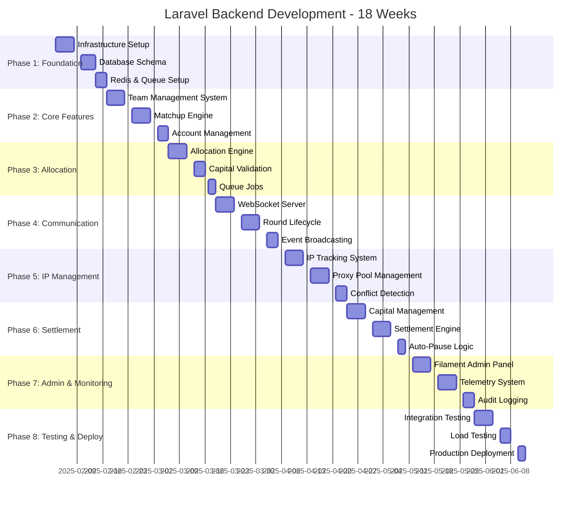
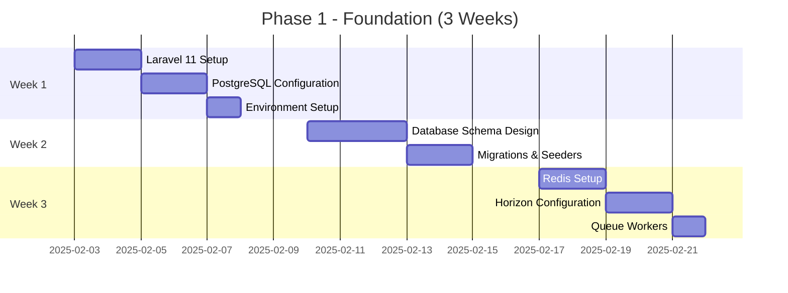
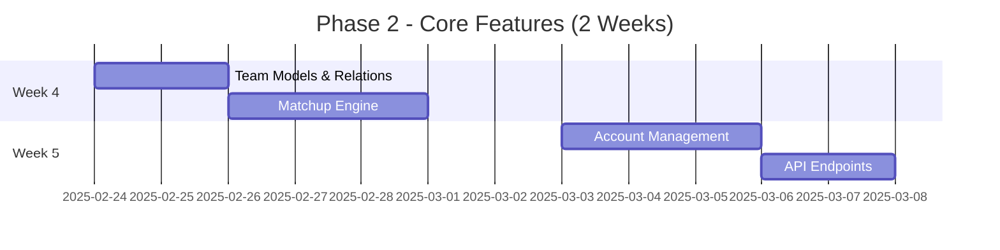
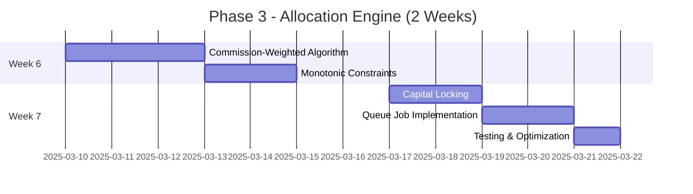
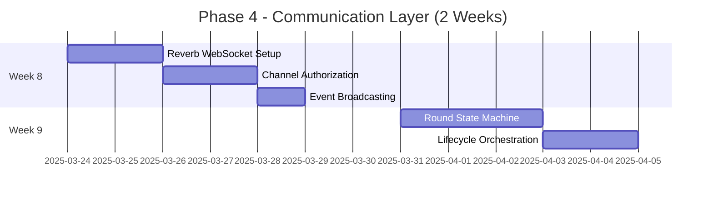
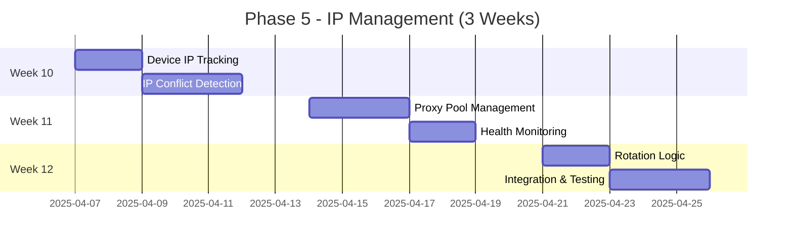
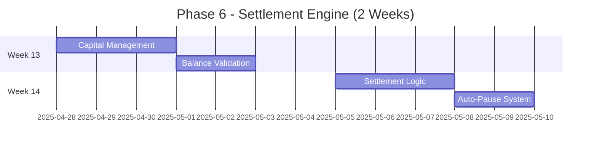
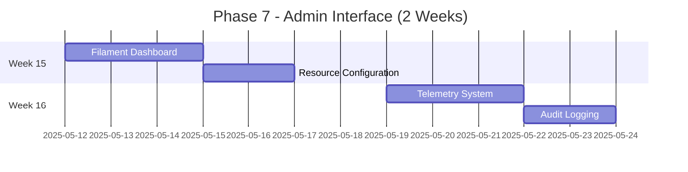
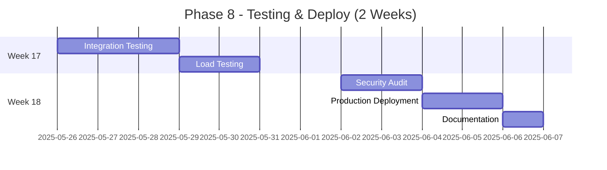
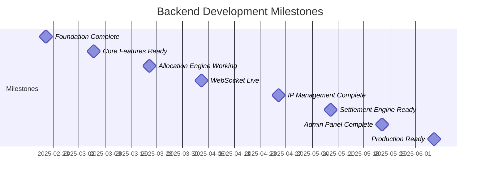

# Laravel Backend Development Timeline
## Full-Stack Backend System for Betting Coordination

**Team:** 2 Backend Engineers  
**Duration:** 18 weeks (Backend can run parallel with Mobile after Week 3)  
**Daily Commitment:** 6-8 hours/day per engineer  
**Tech Stack:** Laravel 11, PostgreSQL, Redis, Reverb WebSocket

---

## 📊 Complete System Gantt Chart (Mermaid)



---

## 📅 Phase Breakdown by Week

### Phase 1: Foundation & Infrastructure (Weeks 1-3)



**Engineer A Focus:** Laravel setup, database design, core models  
**Engineer B Focus:** Redis, queue system, infrastructure

**Deliverables:**
- ✅ Laravel 11 app running
- ✅ PostgreSQL with complete schema
- ✅ Redis configured (cache, sessions, queues)
- ✅ Horizon dashboard operational
- ✅ Environment configurations (dev, staging, prod)

---

### Phase 2: Team & Matchup Management (Weeks 4-5)



**Engineer A Focus:** Team models, relationships, business logic  
**Engineer B Focus:** Matchup algorithms, account management, API

**Deliverables:**
- ✅ Team CRUD with Eloquent models
- ✅ Matchup creation and pairing logic
- ✅ Account-to-team assignment
- ✅ RESTful API endpoints
- ✅ Validation rules

---

### Phase 3: Allocation Engine (Weeks 6-7)



**Engineer A Focus:** Allocation algorithm, seeded RNG, monotonicity  
**Engineer B Focus:** Capital validation, locking mechanism, queue jobs

**Deliverables:**
- ✅ Working allocation engine
- ✅ Commission-weighted distribution
- ✅ Monotonic allocation guaranteed
- ✅ Capital locking with atomic transactions
- ✅ Idempotent queue jobs
- ✅ 95%+ test coverage

---

### Phase 4: Round Lifecycle & WebSocket (Weeks 8-9)



**Engineer A Focus:** WebSocket server, channels, broadcasting  
**Engineer B Focus:** Round state machine, lifecycle management

**Deliverables:**
- ✅ Reverb WebSocket operational
- ✅ Private channels with auth
- ✅ Event broadcasting working
- ✅ Round state machine (5 stages)
- ✅ Prepare → Distribute → Execute flow
- ✅ HMAC signature system

---

### Phase 5: IP Management System (Weeks 10-12)



**Engineer A Focus:** IP tracking, conflict detection, rules engine  
**Engineer B Focus:** Proxy pool, health monitoring, rotation

**Deliverables:**
- ✅ Complete IP management module
- ✅ Conflict detection (concurrent, cooldowns, limits)
- ✅ Proxy pool with health scores
- ✅ Automatic rotation
- ✅ Provider-specific rules
- ✅ Admin dashboard integration

---

### Phase 6: Settlement & Capital (Weeks 13-14)



**Engineer A Focus:** Capital tracking, balance updates, snapshots  
**Engineer B Focus:** Settlement engine, payout calculations, auto-pause

**Deliverables:**
- ✅ Capital management system
- ✅ Real-time balance tracking
- ✅ Settlement engine with result verification
- ✅ Auto-pause on low balance
- ✅ Transaction history
- ✅ Financial reconciliation tools

---

### Phase 7: Admin Panel & Monitoring (Weeks 15-16)



**Engineer A Focus:** Filament admin panel, resources, dashboards  
**Engineer B Focus:** Telemetry collection, audit logs, analytics

**Deliverables:**
- ✅ Complete Filament admin panel
- ✅ Team/Matchup/Account management UI
- ✅ Round monitoring dashboard
- ✅ Telemetry collection endpoints
- ✅ Audit log viewer with search
- ✅ Real-time analytics charts

---

### Phase 8: Testing & Deployment (Weeks 17-18)



**Engineer A Focus:** Integration tests, load testing, optimization  
**Engineer B Focus:** Security audit, deployment, monitoring setup

**Deliverables:**
- ✅ Full test suite (unit, integration, e2e)
- ✅ Load test results (1000+ devices)
- ✅ Security audit complete
- ✅ Production environment deployed
- ✅ Monitoring dashboards live
- ✅ API documentation published

---

## 📋 Complete Phase Table

| Phase | Name | Duration | Weeks | Engineers | Hours |
|-------|------|----------|-------|-----------|-------|
| 1 | Foundation & Infrastructure | 3 weeks | 1-3 | 2 | 240h |
| 2 | Team & Matchup Management | 2 weeks | 4-5 | 2 | 160h |
| 3 | Allocation Engine | 2 weeks | 6-7 | 2 | 160h |
| 4 | Round Lifecycle & WebSocket | 2 weeks | 8-9 | 2 | 160h |
| 5 | IP Management System | 3 weeks | 10-12 | 2 | 240h |
| 6 | Settlement & Capital | 2 weeks | 13-14 | 2 | 160h |
| 7 | Admin Panel & Monitoring | 2 weeks | 15-16 | 2 | 160h |
| 8 | Testing & Deployment | 2 weeks | 17-18 | 2 | 160h |

**Total: 18 weeks, 1,440 hours (720h per engineer)**

---

## 🎯 Key Milestones



---

## ✅ Progress Tracker Template

```markdown
## Backend Development Progress

### Phase 1: Foundation (Weeks 1-3)
- [ ] Week 1: Laravel + PostgreSQL setup
- [ ] Week 2: Database schema complete
- [ ] Week 3: Redis + Horizon configured

### Phase 2: Core Features (Weeks 4-5)
- [ ] Week 4: Teams & Matchups working
- [ ] Week 5: Account management + API

### Phase 3: Allocation (Weeks 6-7)
- [ ] Week 6: Allocation algorithm complete
- [ ] Week 7: Capital locking + queue jobs

### Phase 4: Communication (Weeks 8-9)
- [ ] Week 8: WebSocket operational
- [ ] Week 9: Round lifecycle working

### Phase 5: IP Management (Weeks 10-12)
- [ ] Week 10: IP tracking + conflicts
- [ ] Week 11: Proxy pool management
- [ ] Week 12: Rotation + testing

### Phase 6: Settlement (Weeks 13-14)
- [ ] Week 13: Capital management
- [ ] Week 14: Settlement + auto-pause

### Phase 7: Admin (Weeks 15-16)
- [ ] Week 15: Filament dashboard
- [ ] Week 16: Telemetry + audit logs

### Phase 8: Launch (Weeks 17-18)
- [ ] Week 17: Testing complete
- [ ] Week 18: Production deployed ✨

## Team Status
- **Engineer A:** [Current phase/task]
- **Engineer B:** [Current phase/task]

## Blockers
- None

## Next Sprint
- [Phase X tasks]
```

---

## 💡 Development Strategy

### Parallel Work Approach

**Weeks 1-3:** Sequential (Foundation must be solid)
- Both engineers collaborate on core setup
- Code reviews and pair programming

**Weeks 4-16:** Parallel Development
- Engineer A: Core business logic, models, algorithms
- Engineer B: Infrastructure, APIs, integrations
- Daily sync meetings
- Shared Git workflow (feature branches)

**Weeks 17-18:** Convergence
- Both engineers on testing and deployment
- No new features, only polish

### Code Quality Standards
- PSR-12 coding standards
- PHPStan level 8
- 80%+ code coverage
- All PRs require review
- CI/CD pipeline runs on every commit

### Technology Decisions
- **PHP 8.3** (latest stable)
- **Laravel 11** (latest)
- **PostgreSQL 16** (ACID compliance)
- **Redis 7** (performance)
- **Reverb** (native Laravel WebSocket)
- **Horizon** (queue monitoring)
- **Filament 3** (admin panel)

---

## 🔗 Quick Links

- [[Laravel Backend - Development Stages Guide]]
- [[Backend API Documentation]]
- [[Database Schema Reference]]
- [[Testing Strategy]]
- [[Deployment Checklist]]

---

*Last Updated: 2025-01-27*  
*18-week timeline for 2 backend engineers*
