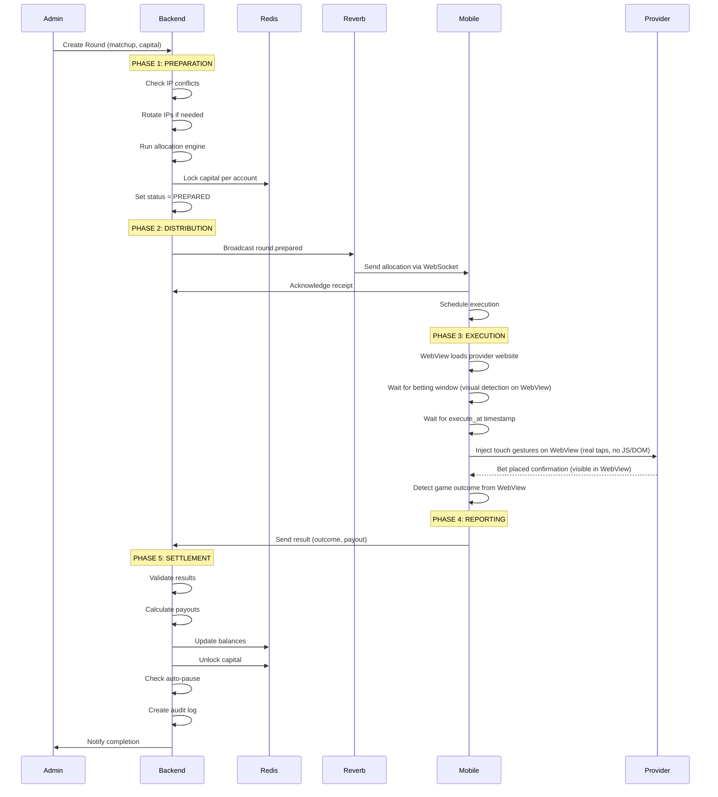
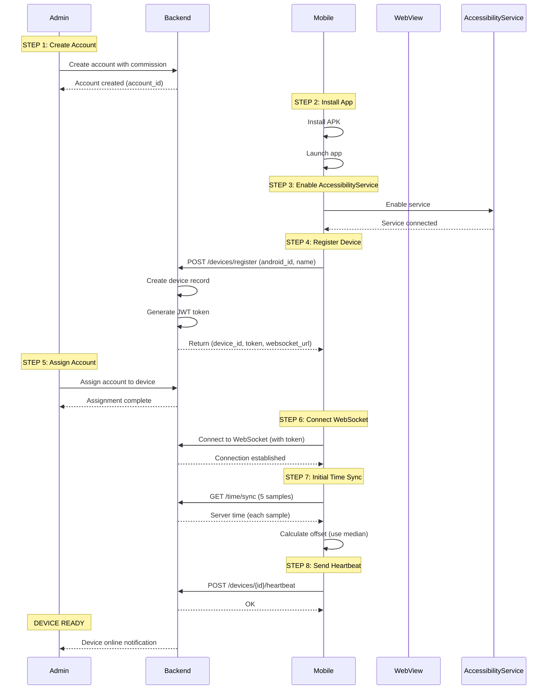
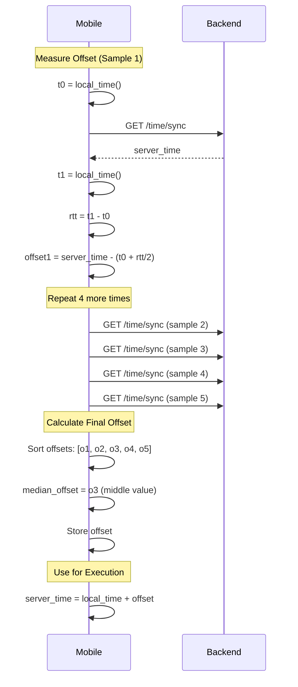
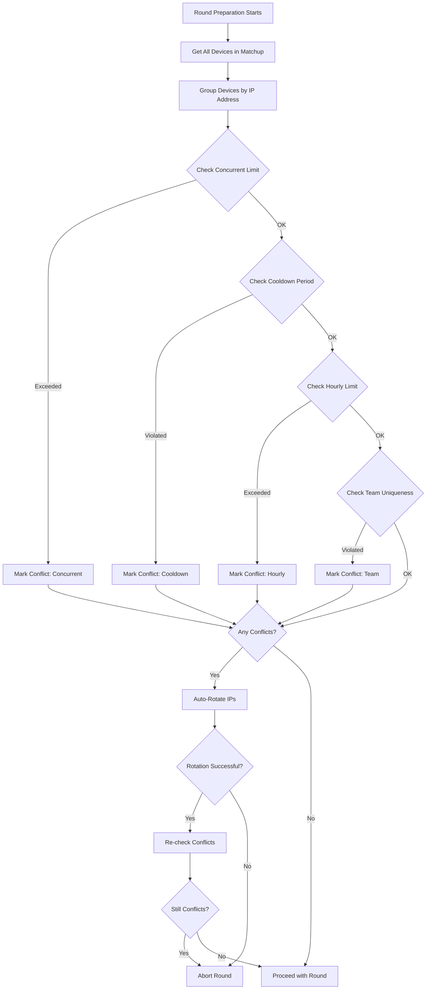
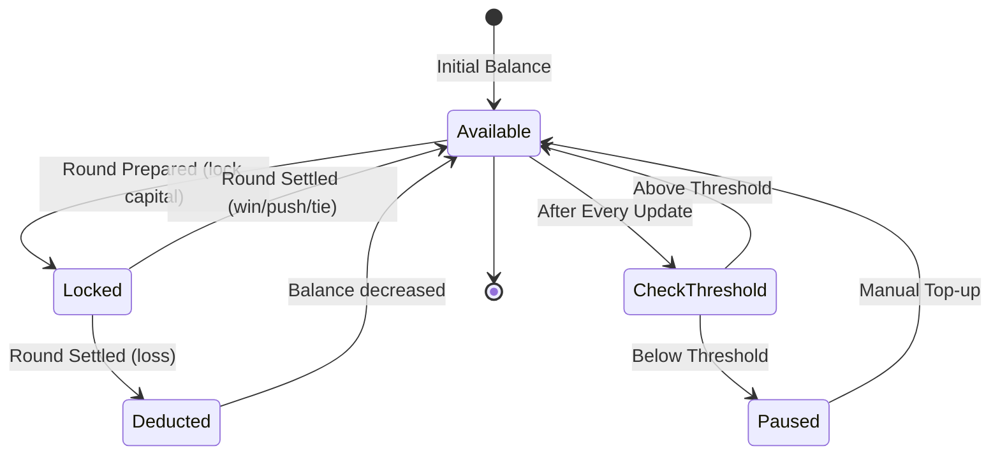

# Integration & Workflows

**Version:** 1.1  
**Last Updated:** January 27, 2026

---

## Table of Contents
1. [Complete Round Execution Workflow](#complete-round-execution-workflow)
2. [Device Registration & Setup](#device-registration--setup)
3. [Time Synchronization Flow](#time-synchronization-flow)
4. [IP Conflict Detection & Rotation](#ip-conflict-detection--rotation)
5. [Capital Management Flow](#capital-management-flow)
6. [Error Handling & Recovery](#error-handling--recovery)
7. [Admin Workflows](#admin-workflows)
8. [Integration Points](#integration-points)

---

## Complete Round Execution Workflow

### Overview
This is the most critical workflow in the system - from round creation to bet settlement.

### Sequence Diagram



### Step-by-Step Flow

#### Phase 1: Preparation (Backend)

**Step 1.1: Validate Matchup**
```php
// Check matchup is active and not locked
$matchup = Matchup::findOrFail($matchup_id);

if ($matchup->status !== 'active') {
    throw new MatchupNotActiveException();
}

if ($matchup->locked_at !== null) {
    throw new MatchupLockedException();
}
```

**Step 1.2: Check IP Conflicts**
```php
// Get all devices for this matchup
$devices = $matchup->getDevices();

// Check for conflicts
$conflicts = IpConflictDetector::check($devices, $provider);

if (!empty($conflicts)) {
    // Attempt automatic resolution
    foreach ($conflicts as $conflict) {
        if ($conflict->severity === 'high') {
            IpRotationService::rotate($conflict->device_id, $provider);
        }
    }
    
    // Re-check after rotation
    $conflicts = IpConflictDetector::check($devices, $provider);
    
    if (!empty($conflicts)) {
        throw new IpConflictException($conflicts);
    }
}
```

**Step 1.3: Run Allocation Engine**
```php
// Get all accounts in matchup
$accounts = $matchup->accounts()->active()->get();

// Generate seed for reproducibility
$seed = hash('sha256', $round_id . $matchup_id . time());

// Run allocation
$allocations = AllocationEngine::allocate(
    accounts: $accounts,
    totalCapital: $total_capital,
    seed: $seed
);
```

**Step 1.4: Lock Capital**
```php
DB::transaction(function () use ($allocations) {
    foreach ($allocations as $allocation) {
        // Verify sufficient funds
        $capital = Capital::where('account_id', $allocation['account_id'])->first();
        $available = $capital->balance - $capital->locked;
        
        if ($available < $allocation['amount']) {
            throw new InsufficientCapitalException(
                account_id: $allocation['account_id'],
                required: $allocation['amount'],
                available: $available
            );
        }
        
        // Lock funds
        $capital->locked += $allocation['amount'];
        $capital->save();
    }
});
```

**Step 1.5: Create Round & Allocations**
```php
$round = Round::create([
    'matchup_id' => $matchup_id,
    'execute_at' => now()->addSeconds(5)->timestamp * 1000, // Unix ms
    'status' => 'prepared',
    'seed' => $seed,
    'total_capital' => $total_capital
]);

foreach ($allocations as $allocation) {
    Allocation::create([
        'round_id' => $round->id,
        'account_id' => $allocation['account_id'],
        'side' => $allocation['side'],
        'amount' => $allocation['amount']
    ]);
}
```

#### Phase 2: Distribution (Backend → Mobile)

**Step 2.1: Build Broadcast Payload**
```php
$payload = [
    'type' => 'round.prepared',
    'round_id' => $round->id,
    'matchup_id' => $round->matchup_id,
    'provider' => $round->matchup->provider,
    'table_id' => $round->matchup->table_id,
    'execute_at' => $round->execute_at,
    'allocations' => $round->allocations->map(fn($a) => [
        'allocation_id' => $a->id,
        'account_id' => $a->account_id,
        'device_id' => $a->account->device->id,
        'side' => $a->side,
        'amount' => $a->amount
    ])
];

// Add HMAC signature
$payload['signature'] = hash_hmac(
    'sha256',
    json_encode($payload),
    config('app.hmac_key')
);
```

**Step 2.2: Broadcast via Reverb**
```php
// Broadcast to provider-table channel
broadcast(new RoundPrepared($round))->toOthers();

// Also broadcast to individual devices
foreach ($round->allocations as $allocation) {
    broadcast(new DeviceAllocationPrepared($allocation))
        ->toChannel("private-device.{$allocation->account->device->id}");
}
```

**Step 2.3: Track Acknowledgments**
```php
// Set timeout for acknowledgments (2 seconds)
$timeout = now()->addSeconds(2);

// Wait for all devices to acknowledge
$acknowledged = [];

while (now() < $timeout) {
    $acknowledged = RoundAcknowledgment::where('round_id', $round->id)
        ->pluck('device_id')
        ->toArray();
    
    if (count($acknowledged) === $round->allocations->count()) {
        break; // All devices acknowledged
    }
    
    usleep(50000); // 50ms
}

// Log missing acknowledgments
$missing = $round->allocations
    ->pluck('account.device.id')
    ->diff($acknowledged);

if ($missing->isNotEmpty()) {
    Log::warning("Missing acknowledgments", [
        'round_id' => $round->id,
        'missing_devices' => $missing
    ]);
}
```

#### Phase 3: Execution (Mobile)

**Step 3.1: Receive & Verify**
```kotlin
// WebSocket message received
fun onMessage(message: String) {
    val roundData = moshi.adapter(RoundPrepared::class.java)
        .fromJson(message)
    
    // Verify signature
    val calculatedSig = hmacSha256(roundData.toJson(), hmacKey)
    if (calculatedSig != roundData.signature) {
        log("❌ Invalid signature for round ${roundData.roundId}")
        return
    }
    
    // Send acknowledgment
    sendAcknowledgment(roundData.roundId)
    
    // Schedule execution
    scheduleExecution(roundData)
}
```

**Step 3.2: Wait for Betting Window**
```kotlin
suspend fun waitForBettingWindow(provider: String) {
    val adapter = ProviderAdapterRegistry.get(provider)
    
    // Poll every 500ms
    while (true) {
        val windowOpen = adapter.detectBettingWindow()
        
        if (windowOpen) {
            log("✓ Betting window open")
            break
        }
        
        delay(500)
    }
}
```

**Step 3.3: Execute at Precise Time**
```kotlin
suspend fun executeAtTimestamp(
    executeAt: Long,
    side: String,
    amount: Double
) {
    // Get server time
    val serverTime = timeSyncManager.getServerTime()
    val delay = executeAt - serverTime
    
    if (delay > 0) {
        delay(delay) // Wait until execute_at
    }
    
    // Execute bet
    val adapter = ProviderAdapterRegistry.get(provider)
    val result = adapter.placeBet(side, amount)
    
    if (result.isSuccess) {
        log("✓ Bet placed: $side $amount")
    } else {
        log("❌ Bet failed: ${result.exceptionOrNull()}")
    }
    
    return result
}
```

**Step 3.4: Detect Outcome**
```kotlin
suspend fun detectOutcome(provider: String): BetOutcome {
    val adapter = ProviderAdapterRegistry.get(provider)
    
    // Wait for game to complete (max 2 minutes)
    val timeout = System.currentTimeMillis() + 120_000
    
    while (System.currentTimeMillis() < timeout) {
        val outcome = adapter.detectResult()
        
        if (outcome != BetOutcome.UNKNOWN) {
            return outcome
        }
        
        delay(1000) // Check every second
    }
    
    return BetOutcome.UNKNOWN
}
```

#### Phase 4: Reporting (Mobile → Backend)

**Step 4.1: Send Result**
```kotlin
fun reportResult(
    roundId: String,
    betPlaced: Boolean,
    outcome: BetOutcome,
    payout: Double
) {
    val result = RoundResult(
        type = "round.result",
        roundId = roundId,
        deviceId = deviceId,
        betPlaced = betPlaced,
        betConfirmed = betPlaced,
        outcome = outcome.name,
        payout = payout,
        executionTimeMs = executionTimeMs,
        timeDriftMs = timeDriftMs
    )
    
    webSocketClient.send(result)
}
```

**Step 4.2: Backend Receives Result**
```php
// WebSocket event listener
public function handle(RoundResultReceived $event)
{
    $result = $event->result;
    
    // Find allocation
    $allocation = Allocation::where('round_id', $result->round_id)
        ->whereHas('account.device', fn($q) => 
            $q->where('id', $result->device_id)
        )
        ->firstOrFail();
    
    // Update allocation
    $allocation->executed_at = now();
    $allocation->outcome = $result->outcome;
    $allocation->payout = $result->payout;
    $allocation->save();
    
    // Check if all allocations completed
    $round = $allocation->round;
    $completed = $round->allocations()
        ->whereNotNull('outcome')
        ->count();
    
    if ($completed === $round->allocations()->count()) {
        // All devices reported - settle round
        dispatch(new SettleRound($round->id));
    }
}
```

#### Phase 5: Settlement (Backend)

**Step 5.1: Validate Results**
```php
public function settle(Round $round)
{
    DB::transaction(function () use ($round) {
        foreach ($round->allocations as $allocation) {
            // Validate outcome exists
            if ($allocation->outcome === null) {
                throw new MissingOutcomeException($allocation->id);
            }
            
            $capital = $allocation->account->capital;
            
            // Update balance based on outcome
            switch ($allocation->outcome) {
                case 'win':
                    $capital->balance += $allocation->payout;
                    break;
                    
                case 'loss':
                    $capital->balance -= $allocation->amount;
                    break;
                    
                case 'tie':
                case 'push':
                    // No change - bet returned
                    break;
            }
            
            // Unlock capital
            $capital->locked -= $allocation->amount;
            $capital->save();
            
            // Check auto-pause
            $this->checkAutoPause($allocation->account);
        }
        
        // Update round status
        $round->status = 'completed';
        $round->save();
    });
}
```

**Step 5.2: Auto-Pause Check**
```php
private function checkAutoPause(Account $account)
{
    $capital = $account->capital;
    $available = $capital->balance - $capital->locked;
    
    if ($available < $account->min_balance_threshold) {
        $account->status = 'paused';
        $account->save();
        
        // Notify admin
        Notification::send(
            Admin::all(),
            new LowBalanceAlert($account)
        );
        
        // Audit log
        AuditLog::create([
            'actor' => 'system',
            'action' => 'account.auto_paused',
            'entity_type' => 'Account',
            'entity_id' => $account->id,
            'payload' => [
                'available_balance' => $available,
                'threshold' => $account->min_balance_threshold
            ]
        ]);
    }
}
```

**Step 5.3: Create Audit Trail**
```php
// Log complete round execution
AuditLog::create([
    'actor' => 'system',
    'action' => 'round.completed',
    'entity_type' => 'Round',
    'entity_id' => $round->id,
    'payload' => [
        'total_capital' => $round->total_capital,
        'allocations_count' => $round->allocations->count(),
        'successful_executions' => $round->allocations->where('bet_placed', true)->count(),
        'total_payout' => $round->allocations->sum('payout'),
        'execution_time' => $round->created_at->diffInSeconds($round->updated_at)
    ]
]);
```

---

## Device Registration & Setup

### Sequence Diagram



### Setup Checklist

**Backend Setup:**
- [ ] Account created with commission rate
- [ ] Account has initial capital balance
- [ ] Device registered and approved
- [ ] Device assigned to account
- [ ] Team assignment (optional)

**Mobile Setup:**
- [ ] App installed
- [ ] AccessibilityService enabled
- [ ] WebView configured and provider website accessible
- [ ] Battery optimization disabled
- [ ] Device registered with backend
- [ ] WebSocket connected
- [ ] Time synchronized (offset calculated)
- [ ] Heartbeat sending every 30 seconds

**Verification:**
```kotlin
// Mobile self-check
suspend fun verifyDeviceReady(): Boolean {
    val checks = listOf(
        "AccessibilityService" to isAccessibilityServiceEnabled(),
        "WebSocket" to webSocketClient.isConnected(),
        "Time Sync" to (timeSyncManager.lastSync != null),
        "Battery Opt" to isBatteryOptimizationDisabled(),
        "Account Assigned" to (accountId != null)
    )
    
    checks.forEach { (name, passed) ->
        log("$name: ${if (passed) "✓" else "❌"}")
    }
    
    return checks.all { it.second }
}
```

---

## Time Synchronization Flow

### Purpose
Ensure all devices execute bets at the exact same moment (±50ms accuracy).

### Algorithm Flow



### Implementation

```kotlin
class TimeSyncManager {
    private var offset: Long = 0
    private var lastSync: Instant? = null
    
    suspend fun synchronize(): TimeSyncResult {
        val samples = List(5) { measureOffset() }
        
        // Use median to filter outliers
        val sortedOffsets = samples.map { it.offset }.sorted()
        offset = sortedOffsets[sortedOffsets.size / 2]
        
        // Calculate precision (min RTT / 2)
        val precision = samples.minOf { it.rtt } / 2
        
        lastSync = Instant.now()
        
        return TimeSyncResult(
            offset = offset,
            precision = precision,
            samples = samples
        )
    }
    
    private suspend fun measureOffset(): Sample {
        val t0 = System.currentTimeMillis()
        
        val response = apiClient.getServerTime()
        val serverTime = response.serverTime
        
        val t1 = System.currentTimeMillis()
        val rtt = t1 - t0
        
        // Server time corresponds to midpoint of request
        val offset = serverTime - (t0 + rtt / 2)
        
        return Sample(offset = offset, rtt = rtt)
    }
    
    fun getServerTime(): Long {
        return System.currentTimeMillis() + offset
    }
    
    fun shouldSync(): Boolean {
        val lastSyncTime = lastSync ?: return true
        val elapsed = Duration.between(lastSyncTime, Instant.now())
        
        // Sync every 5 minutes
        return elapsed.toMinutes() >= 5
    }
}
```

### Sync Triggers

1. **App Launch**: Immediate sync when app starts
2. **Periodic**: Every 5 minutes while app running
3. **Pre-Round**: 10 seconds before round execution
4. **Reconnection**: After WebSocket reconnect
5. **High Drift**: If time drift exceeds 200ms

---

## IP Conflict Detection & Rotation

### Conflict Detection Flow



### Auto-Rotation Implementation

```php
class IpRotationService
{
    public function rotateDeviceIp(
        string $deviceId,
        string $provider,
        ?string $preferredRegion = null
    ): IpConfig {
        // Step 1: Select best proxy
        $proxy = $this->selectProxy($provider, $preferredRegion);
        
        if ($proxy === null) {
            throw new NoProxyAvailableException();
        }
        
        // Step 2: Deactivate current IP
        DeviceIp::where('device_id', $deviceId)
            ->where('is_active', true)
            ->update([
                'is_active' => false,
                'active_until' => now()
            ]);
        
        // Step 3: Create new device_ip record
        $deviceIp = DeviceIp::create([
            'device_id' => $deviceId,
            'ip_address' => $proxy->ip_address,
            'ip_type' => 'proxy',
            'proxy_config' => [
                'proxy_id' => $proxy->id,
                'port' => $proxy->port,
                'protocol' => $proxy->protocol,
                'username' => $proxy->username,
                'configured_at' => now()->timestamp
            ],
            'is_active' => true
        ]);
        
        // Step 4: Return config for mobile
        return new IpConfig(
            ip_address: $proxy->ip_address,
            port: $proxy->port,
            protocol: $proxy->protocol,
            username: $proxy->username,
            password: decrypt($proxy->password_encrypted)
        );
    }
    
    private function selectProxy(
        string $provider,
        ?string $region
    ): ?Proxy {
        return Proxy::query()
            ->where('status', 'active')
            ->where('health_score', '>', 0.5)
            ->whereNotIn('banned_by_providers', [$provider])
            ->when($region, fn($q) => 
                $q->where('geographic_region', $region)
            )
            ->orderByRaw('
                CASE WHEN geographic_region = ? THEN 0 ELSE 1 END,
                health_score DESC,
                total_uses ASC
            ', [$region])
            ->first();
    }
}
```

### Mobile Proxy Configuration

```kotlin
// Receive proxy config from backend
fun configureProxy(config: IpConfig) {
    val proxySelector = ProxySelector.of(
        InetSocketAddress(config.ipAddress, config.port)
    )
    
    val authenticator = Authenticator { _, _ ->
        PasswordAuthentication(
            config.username,
            config.password.toCharArray()
        )
    }
    
    // Update OkHttp client
    val newClient = OkHttpClient.Builder()
        .proxySelector(proxySelector)
        .proxyAuthenticator { _, response ->
            response.request.newBuilder()
                .header("Proxy-Authorization", 
                    Credentials.basic(config.username, config.password))
                .build()
        }
        .build()
    
    webSocketClient.updateClient(newClient)
}
```

---

## Capital Management Flow

### Balance Update Workflow



### Double-Entry Accounting

```php
class CapitalTransaction
{
    public static function record(
        string $accountId,
        float $amount,
        string $type, // 'lock', 'unlock', 'win', 'loss'
        string $roundId = null
    ): void {
        DB::transaction(function () use ($accountId, $amount, $type, $roundId) {
            $capital = Capital::lockForUpdate()
                ->where('account_id', $accountId)
                ->first();
            
            // Create transaction record
            CapitalTransaction::create([
                'account_id' => $accountId,
                'round_id' => $roundId,
                'type' => $type,
                'amount' => $amount,
                'balance_before' => $capital->balance,
                'locked_before' => $capital->locked
            ]);
            
            // Update capital
            switch ($type) {
                case 'lock':
                    if ($capital->balance - $capital->locked < $amount) {
                        throw new InsufficientCapitalException();
                    }
                    $capital->locked += $amount;
                    break;
                    
                case 'unlock':
                    $capital->locked -= $amount;
                    break;
                    
                case 'win':
                    $capital->balance += $amount;
                    break;
                    
                case 'loss':
                    $capital->balance -= $amount;
                    break;
            }
            
            $capital->save();
            
            // Update transaction with after balances
            CapitalTransaction::where('account_id', $accountId)
                ->latest()
                ->first()
                ->update([
                    'balance_after' => $capital->balance,
                    'locked_after' => $capital->locked
                ]);
        });
    }
}
```

---

## Error Handling & Recovery

### Error Categories

#### 1. Transient Errors (Retry)
```kotlin
// WebSocket disconnection
webSocketClient.onFailure = { exception ->
    log("WebSocket failed: ${exception.message}")
    
    // Exponential backoff retry
    var delay = 1000L
    repeat(5) { attempt ->
        delay(delay)
        
        val reconnected = webSocketClient.reconnect()
        if (reconnected) {
            log("✓ Reconnected after $attempt attempts")
            return@onFailure
        }
        
        delay *= 2 // Exponential backoff
    }
    
    log("❌ Failed to reconnect after 5 attempts")
    notifyUser("Connection lost. Please check internet.")
}
```

#### 2. Validation Errors (Abort)
```php
// Insufficient capital
try {
    $this->allocate($round, $capital);
} catch (InsufficientCapitalException $e) {
    // Cannot retry - abort round
    $round->status = 'aborted';
    $round->save();
    
    // Notify admin
    Notification::send(
        Admin::all(),
        new RoundAbortedAlert($round, $e->getMessage())
    );
    
    // Unlock any capital that was locked
    $this->unlockAllCapital($round);
}
```

#### 3. Provider Errors (Device-Specific)
```kotlin
// Bet placement failed
val result = adapter.placeBet(side, amount)

if (result.isFailure) {
    val error = result.exceptionOrNull()
    
    when (error) {
        is BettingWindowClosedException -> {
            // Too late - report as failed
            reportResult(
                roundId = roundId,
                betPlaced = false,
                outcome = BetOutcome.UNKNOWN,
                payout = 0.0
            )
        }
        
        is ButtonNotFoundException -> {
            // UI changed - needs adapter update
            logCritical("UI element not found: ${error.element}")
            notifyAdmin("Provider UI changed - update needed")
        }
        
        is AccessibilityServiceRevokedException -> {
            // User disabled service
            notifyUser("Please re-enable Accessibility Service")
            pauseDevice()
        }
    }
}
```

### Recovery Strategies

#### Round Recovery
```php
public function recoverStuckRounds(): void
{
    // Find rounds stuck in 'executing' for > 5 minutes
    $stuckRounds = Round::where('status', 'executing')
        ->where('updated_at', '<', now()->subMinutes(5))
        ->get();
    
    foreach ($stuckRounds as $round) {
        Log::warning("Recovering stuck round", ['round_id' => $round->id]);
        
        // Check how many devices reported
        $reported = $round->allocations()
            ->whereNotNull('outcome')
            ->count();
        
        $total = $round->allocations()->count();
        
        if ($reported >= $total * 0.8) {
            // 80%+ reported - settle with what we have
            $this->settlePartialRound($round);
        } else {
            // Too few reports - abort and refund
            $this->abortAndRefund($round);
        }
    }
}
```

---

## Admin Workflows

### Daily Operations

#### Morning Setup
1. **Check System Health**
   - All devices online?
   - WebSocket connections active?
   - Any low balance alerts?
   - Proxy health scores acceptable?

2. **Review Overnight Activity**
   - Total rounds executed
   - Success rate
   - Any errors or conflicts
   - Capital changes

3. **Prepare for Day**
   - Top up low balance accounts
   - Rotate any degraded proxies
   - Create new matchups if needed

#### During Operations
1. **Monitor Dashboard**
   - Active rounds
   - Device status
   - Success rate
   - IP conflicts

2. **Handle Alerts**
   - Low balance → top up or pause
   - IP conflict → rotate proxy
   - Device offline → investigate
   - High error rate → check provider

#### End of Day
1. **Review Statistics**
   - Total capital deployed
   - Win/loss ratio
   - Device performance
   - System uptime

2. **Generate Reports**
   - Daily P&L by account
   - Device reliability scores
   - Provider performance
   - Capital utilization

---

## Integration Points

### Backend ↔ Mobile

| Feature | Protocol | Direction | Frequency |
|---------|----------|-----------|-----------|
| Round Instructions | WebSocket | Backend → Mobile | Per round |
| Acknowledgments | WebSocket | Mobile → Backend | Per round |
| Results | WebSocket | Mobile → Backend | Per round |
| Heartbeat | HTTP | Mobile → Backend | Every 30s |
| Time Sync | HTTP | Mobile → Backend | Every 5min |
| IP Rotation | HTTP | Backend → Mobile | On conflict |
| Device Registration | HTTP | Mobile → Backend | Once |

### Backend ↔ Database

| Operation | Isolation Level | Lock Type |
|-----------|----------------|-----------|
| Capital Lock | SERIALIZABLE | Row Lock |
| Allocation Create | READ COMMITTED | Table Lock |
| Balance Update | SERIALIZABLE | Row Lock |
| Round Settlement | SERIALIZABLE | Row Lock |
| Audit Log | READ COMMITTED | No Lock |

### Backend ↔ Redis

| Data Type | TTL | Use Case |
|-----------|-----|----------|
| Cache | 1 hour | Account data, team compositions |
| Session | 24 hours | Admin authentication |
| Queue | N/A | Background jobs |
| Locks | 30 seconds | Distributed locking |
| Rate Limit | 1 minute | API throttling |

---

## Links to Related Documents

- [[1. System Overview]]
- [[2. Architecture]]
- [[3. Database Schema]]
- [[4. API Specification]]
- [[8. Business Rules & Algorithms]]
- [[../Backend/Laravel Backend - Development Stages Guide]]
- [[../Android/Kotlin Android MVP Development Roadmap]]

---

*Last updated: January 27, 2026*
